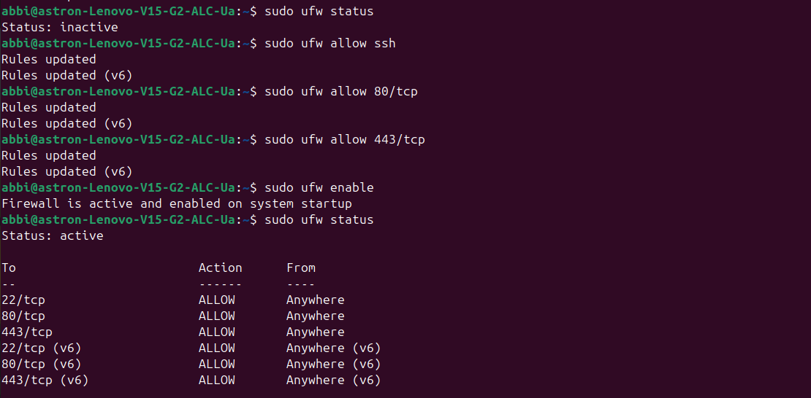
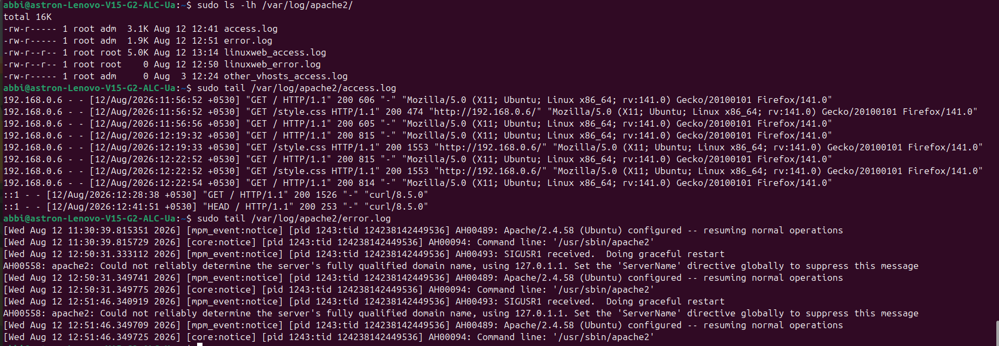

# Linux Web Server on Ubuntu

## Project Overview

This project demonstrates the setup and configuration of an Apache web server on Ubuntu Linux to host a static website.

The project includes Apache web server configuration, Virtual Hosts, file permissions, UFW firewall configuration, and HTTPS configuration.

## Technologies Used

- Ubuntu Linux
- Apache Web Server
- HTML
- CSS
- UFW Firewall
- HTTPS / SSL

## Project Architecture

The project follows this basic architecture:

```text
User's Web Browser
        │
        │ HTTP / HTTPS
        ▼
   Apache Web Server
        │
        │ Virtual Host
        ▼
 /var/www/html/
        │
        ├── index.html
        └── style.css
```

### How it works

1. The user enters the website address in a web browser.
2. The request reaches the Apache web server running on Ubuntu.
3. Apache uses the configured Virtual Host to handle the request.
4. Apache serves the website files from `/var/www/html/`.
5. The browser receives `index.html` and `style.css` and displays the website.


## Apache Web Server Setup

Apache was installed on Ubuntu using the APT package manager.

### Installation

```bash
sudo apt update
sudo apt install apache2
```

### Start Apache

Apache was started using:

```bash
sudo systemctl start apache2
```

The Apache service status was verified using:

```bash
sudo systemctl status apache2
```

Apache was also enabled to start automatically when the system boots:

```bash
sudo systemctl enable apache2
```

### Verify Apache

The Apache web server was tested by accessing the server's IP address from a web browser.

If Apache is running correctly, the browser displays the hosted website.


## Virtual Host Configuration

Apache Virtual Hosts allow multiple websites to be hosted on the same server.

For this project, a custom Virtual Host was created for the website.

### Configuration File

The Virtual Host configuration is stored in:

```text
/etc/apache2/sites-available/linuxweb.conf
```

The configuration points Apache to the website's document root:

```apache
<VirtualHost *:80>

    ServerName linuxweb.local

    Redirect permanent / https://linuxweb.local/

</VirtualHost>
```

### Enable the Virtual Host

The site was enabled using:

```bash
sudo a2ensite linuxweb.conf
```

Apache configuration was checked for errors using:

```bash
sudo apache2ctl configtest
```

If the configuration is valid, Apache returns:

```text
Syntax OK
```

Apache was then reloaded to apply the configuration:

```bash
sudo systemctl reload apache2
```

## File Permissions

The website files were stored in Apache's default document root:

```text
/var/www/html/
```

File ownership and permissions were checked using:

```bash
ls -l /var/www/html/
```

The files were given appropriate ownership and permissions so that Apache could read and serve the website while maintaining basic security.

The permission settings were verified using the Linux `ls -l` command.


## UFW Firewall Configuration

The UFW (Uncomplicated Firewall) was configured to control incoming network traffic to the Ubuntu server.

### Check Firewall Status

The firewall status was checked using:

```bash
sudo ufw status
```

### Allow SSH

SSH was allowed so that the server could be accessed remotely:

```bash
sudo ufw allow ssh
```

### Allow HTTP and HTTPS

HTTP and HTTPS traffic were allowed for the web server:

```bash
sudo ufw allow 80/tcp
sudo ufw allow 443/tcp
```

### Enable UFW

The firewall was enabled using:

```bash
sudo ufw enable
```

The final firewall configuration was verified using:

```bash
sudo ufw status
```

The firewall allows the required web traffic while blocking other unwanted incoming connections.


## HTTPS / SSL Configuration

HTTPS was configured to secure communication between the web browser and the Apache web server.

### SSL Certificate

An SSL certificate and private key were configured for the website.

The certificate and key were stored on the Ubuntu server at:

```text
/etc/apache2/ssl/linuxweb.crt
/etc/apache2/ssl/linuxweb.key
```
### Enable SSL

Apache SSL support was enabled using:

```bash
sudo a2enmod ssl
```

The HTTPS Virtual Host was configured to listen on port 443:

```apache
<VirtualHost *:443>
    ServerName linuxweb.local

    DocumentRoot /var/www/linuxweb

    SSLEngine on

    SSLCertificateFile /etc/apache2/ssl/linuxweb.crt
    SSLCertificateKeyFile /etc/apache2/ssl/linuxweb.key
```

The website directory was configured to allow Apache to serve the files:

```apache
<Directory /var/www/linuxweb>
    AllowOverride All
    Require all granted
</Directory>
```

### HTTP to HTTPS Redirect

HTTP requests were redirected to HTTPS using the HTTP Virtual Host:

```apache
<VirtualHost *:80>

    ServerName linuxweb.local

    Redirect permanent / https://linuxweb.local/

</VirtualHost>
```

Therefore, when a user visits:

```text
http://linuxweb.local
```

the request is automatically redirected to:

```text
https://linuxweb.local
```

### HTTPS Flow

```text
Browser
   │
   │ http://linuxweb.local
   ▼
Apache :80
   │
   │ Permanent Redirect
   ▼
Apache :443
   │
   │ SSL/TLS
   ▼
/var/www/linuxweb/
   │
   ├── index.html
   └── style.css
```

### Verify HTTPS

The HTTPS configuration was tested by accessing:

```text
https://linuxweb.local
```

in a web browser and verifying that the website loaded over HTTPS.


## Testing and Verification

After configuring Apache, the Virtual Hosts, firewall, and HTTPS, the web server was tested to verify that all components were working correctly.

### 1. Check Apache Status

The Apache service was checked using:

```bash
sudo systemctl status apache2
```

The service should show:

```text
active (running)
```

### 2. Check Apache Configuration

The Apache configuration was validated using:

```bash
sudo apache2ctl configtest
```

A successful configuration check returns:

```text
Syntax OK
```

### 3. Test HTTP to HTTPS Redirect

The HTTP address was accessed:

```text
http://linuxweb.local
```

The request was automatically redirected to:

```text
https://linuxweb.local
```

### 4. Test HTTPS Website

The HTTPS website was accessed using:

```text
https://linuxweb.local
```

The website loaded successfully over HTTPS.

### 5. Check Firewall

The UFW firewall configuration was verified using:

```bash
sudo ufw status
```

The required ports for SSH, HTTP, and HTTPS were checked to ensure that the necessary traffic was allowed.

### 6. Verify Website Files

The website files were checked using:

```bash
ls -l /var/www/linuxweb/
```

The directory contains the website files required by Apache.

### Testing Result

The Linux web server was successfully configured and tested.

The final setup supports:

- Apache web server
- Custom Virtual Host
- HTTP to HTTPS redirection
- HTTPS / SSL
- Website hosting
- Linux file permissions
- UFW firewall configuration

## Screenshots

### Apache Service Status

This screenshot shows the Apache web server running successfully.


### UFW Firewall Configuration

This screenshot shows the UFW firewall configuration and allowed network traffic.



### Apache Logs

This screenshot shows the Apache log output used to verify web server activity.



### Virtual Host Configuration

This screenshot shows the configured Apache Virtual Host.


### TLS Certificate and Key Setup

This screenshot shows the creation of the self-signed TLS certificate and the corresponding private key on the Ubuntu server. The private key was protected with restricted file permissions and was not included in this project.


### HTTPS Configuration and Verification

This screenshot shows the SSL module being enabled, the HTTPS Virtual Host being configured, Apache configuration testing, and port 443 listening for HTTPS traffic.


### Hosted Web Page

This screenshot shows the website successfully hosted on the Apache web server.


## What I Learned

Through this project, I gained practical experience in:

- Installing and managing the Apache web server on Ubuntu Linux.
- Configuring Apache Virtual Hosts.
- Hosting a static website on a Linux server.
- Managing Linux file permissions and ownership.
- Configuring the UFW firewall and allowing required network ports.
- Configuring HTTPS using SSL/TLS certificates.
- Redirecting HTTP traffic to HTTPS.
- Testing and troubleshooting Apache configurations and web server logs.
- Understanding the basic workflow of a Linux-based web server.find . -maxdepth 2 -type f
